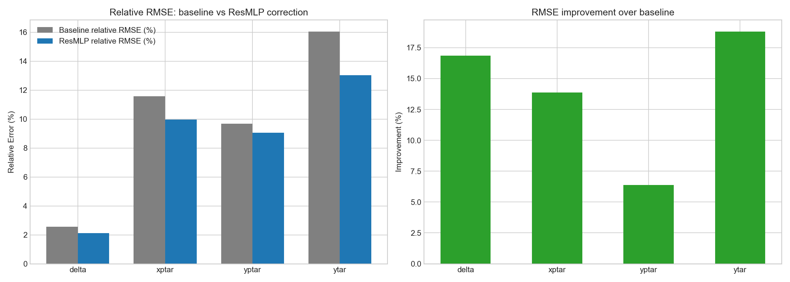
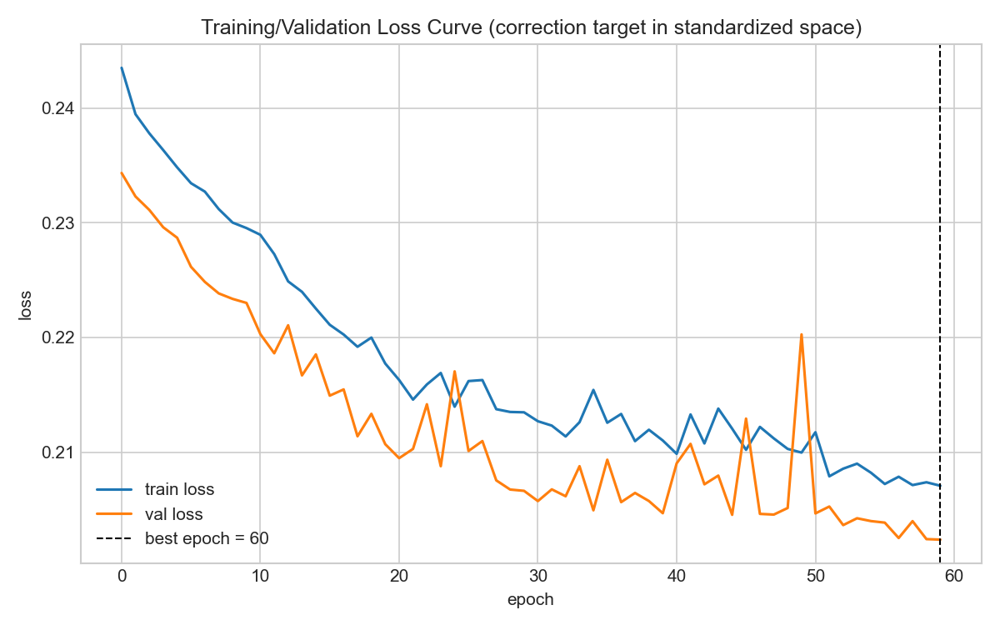
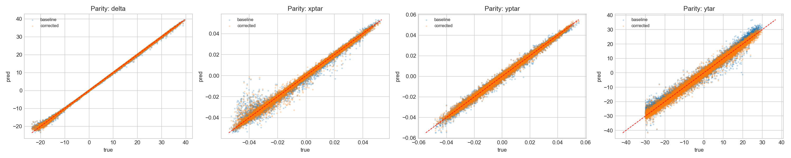
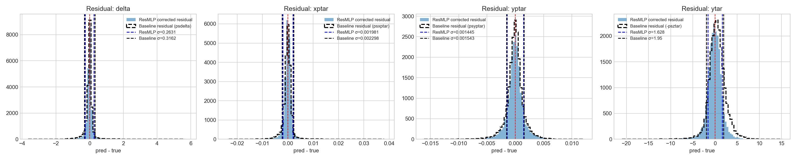
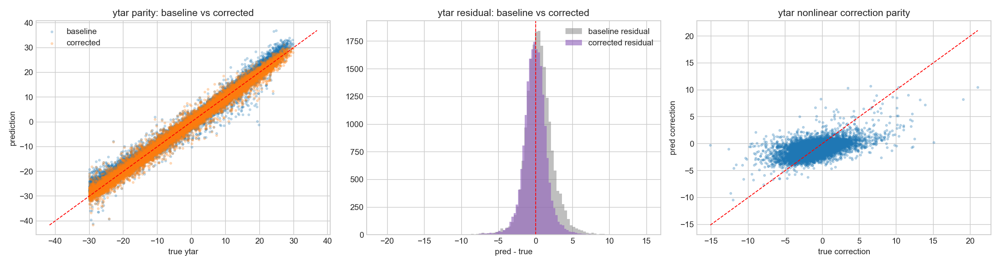

# ResMLP_root 实验记录

- 日期：`2026-04-09`
- Notebook：`SHMS_Calibration_NN/experiments/ResMLP/ResMLP_root.ipynb`
- 最新运行标签：`20260409_040145`
- 训练模式：`root-reco-correction`

## 1. 实验目标

`ResMLP_root` 的目标是验证一种 **基于 ROOT 重建结果的残差校正方案**：

- 先使用 ROOT / 线性 optics 重建结果作为 baseline；
- 再由 ResMLP 学习 `truth - ROOT_reco` 的非线性修正项；
- 最终输出为：

$$
\hat y = y_{\text{ROOT}} + \Delta y_{\text{MLP}}
$$

其中：

- $y_{\text{ROOT}}$ 表示 ROOT 给出的重建值；
- $\Delta y_{\text{MLP}}$ 表示网络学习得到的 correction；
- $\hat y$ 是校正后的最终预测。

这个版本的核心思想不是脱离 ROOT，而是把 ROOT 当作一个已经具备物理先验的 baseline，让网络只负责学习 ROOT 没有捕捉好的高阶非线性部分。

## 2. 模型结构

当前 `ResMLP_root` 的网络部分是一个多输出残差 MLP，用来预测 correction term：

1. **输入层**
   - 输入特征：`x_fp, y_fp, xp_fp, yp_fp, x_tar, p0`
   - 先投影到 hidden 维度。

2. **Residual blocks**
   - 由多个残差块组成；
   - 每个 block 内部采用 skip connection；
   - 作用是稳定训练并提高对非线性结构的表达能力。

3. **输出头**
   - 直接输出各目标的 correction：

$$
\Delta y_{\text{MLP}} = f_{\text{ResMLP}}(x)
$$

最终预测为：

$$
\hat y = y_{\text{ROOT}} + f_{\text{ResMLP}}(x)
$$

这意味着该模型本质上是一个 **ROOT baseline + learned nonlinear residual** 的后处理校正器。

## 3. 训练策略

本次最新运行使用的关键配置如下：

- 数据文件：`mc-single-arm/worksim/shms_extended_nosieve.root`
- 树名：`h10`
- 模式：`all`
- 输入特征：`x_fp, y_fp, xp_fp, yp_fp, x_tar, p0`
- 输出目标：`delta, xptar, yptar, ytar`
- 事件数：100000
- 训练 / 验证划分：80000 / 20000
- Batch size：2048
- Epochs：60
- 学习率：`8e-4`
- Weight decay：`1e-4`
- Hidden dim：192
- Residual blocks：3
- Dropout：0.10
- 损失函数：加权 `SmoothL1`
- 梯度裁剪：`1.0`
- `ytar` loss weight：`0.40`
- 早停 patience：12
- 学习率调度：`ReduceLROnPlateau`

这个版本直接训练 correction target：

$$
\Delta y_{\text{target}} = y_{\text{truth}} - y_{\text{ROOT}}
$$

网络只需要学习 residual，因此训练目标比直接回归 truth 更集中，也更容易体现 ROOT baseline 的物理先验优势。

## 4. 最新训练结果（2026-04-09 04:01:45）

### 4.1 总体结果

- `best_epoch = 60`
- `best_val_loss = 0.202373`
- `n_train = 80000`
- `n_val = 20000`

### 4.2 各目标 RMSE：baseline vs 校正后

| Target | ROOT baseline RMSE | ResMLP_root RMSE | RMSE 改善 |
|---|---:|---:|---:|
| delta | 0.316722 | 0.263295 | 16.87% |
| xptar | 0.002300 | 0.001981 | 13.88% |
| yptar | 0.001544 | 0.001445 | 6.38% |
| ytar | 2.006160 | 1.628922 | 18.80% |

### 4.3 各目标 MAE：baseline vs 校正后

| Target | ROOT baseline MAE | ResMLP_root MAE | MAE 改善 |
|---|---:|---:|---:|
| delta | 0.147366 | 0.122082 | 17.16% |
| xptar | 0.001191 | 0.001052 | 11.71% |
| yptar | 0.001048 | 0.000999 | 4.66% |
| ytar | 1.443437 | 1.178991 | 18.32% |

### 4.4 相对误差（校正后）

| Target | Relative RMSE | Relative MAE |
|---|---:|---:|
| delta | 2.12% | 0.98% |
| xptar | 9.97% | 5.30% |
| yptar | 9.05% | 6.26% |
| ytar | 13.03% | 9.43% |

## 5. 关键观察

1. **这个版本在四个目标上都优于 ROOT baseline**。
2. `ytar` 的改善最明显之一：
   - ROOT baseline RMSE = `2.006160`
   - ResMLP_root RMSE = `1.628922`
3. `delta` 的收益也较明显，说明 residual correction 对这类高阶偏差确实有效。
4. `yptar` 的提升幅度较小，表明 ROOT 对这个量本身已经较强，留给网络可学习的空间较有限。
5. 这是一个非常强的工程基线，因为它把 ROOT 的物理先验和神经网络的非线性拟合能力结合起来了。

## 6. ytar 专项诊断

来自诊断输出的 `ytar` 非线性相关性显示：

| Source | corr with ytar nonlinear part |
|---|---:|
| `y_fp` | 0.0819 |
| `yp_fp` | 0.0676 |
| `xp_fp` | -0.0581 |
| `x_fp` | -0.0524 |
| `yptar` | 0.0516 |

这说明：

- `ytar` 的非线性部分并不是完全无信息可学；
- ROOT baseline 去掉大部分主干后，剩余 correction 仍能从前端 focal plane 特征中提取；
- 这也是为什么 `ResMLP_root` 在 `ytar` 上表现明显好于纯 ROOT baseline。

## 7. 可视化结果

### 7.1 Relative RMSE 对比

### 7.2 训练 / 验证 Loss 曲线

### 7.3 Parity 图

### 7.4 Residual 分布图

### 7.5 ytar 专项诊断图

## 8. 结果解读

`ResMLP_root` 是一个非常典型、也非常有效的 residual learning 方案：

- ROOT 提供 baseline；
- ResMLP 只学 ROOT 的误差项；
- 因而训练目标更集中，优化难度更低；
- 结果上能在多个目标上稳定取得提升。

从性能角度看，这一版比完全脱离 ROOT 的 `ResMLP_transport` 更容易拿到较强的数值结果，原因也很直接：

- ROOT 已经编码了大量 optics 先验；
- 网络无需从头学习主干结构；
- 只需专注 correction。

因此，`ResMLP_root` 非常适合作为：

- **强基线模型**；
- **对照实验版本**；
- **验证某个目标是否存在可学习 residual 的探针模型**。

## 9. 与 ROOT-free 方案的关系

`ResMLP_root` 和 `ResMLP_transport` 的定位不同：

- `ResMLP_root`：追求 **ROOT baseline 上的性能增益**；
- `ResMLP_transport`：追求 **摆脱 ROOT 依赖的结构性独立**。

所以二者不是简单替代关系，而是：

- 一个更强于工程效果；
- 一个更强于方法独立性与结构可解释性。

## 10. 关联产物

- 指标 JSON：`../outputs_notebook/resmlp_metrics_all_20260409_040145.json`
- 指标 CSV：`../outputs_notebook/resmlp_metrics_all_20260409_040145.csv`
- Notebook：`../ResMLP_root.ipynb`

## 11. 一句话总结

`ResMLP_root` 通过学习 `truth - ROOT_reco` 的 residual，在保留 ROOT 物理先验的前提下显著改进了 `delta / xptar / yptar / ytar` 的重建精度，是当前非常强、非常稳定的 ROOT-based 非线性校正基线。
