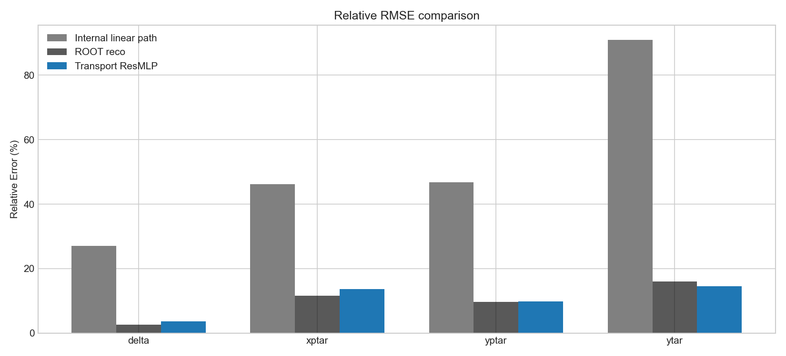
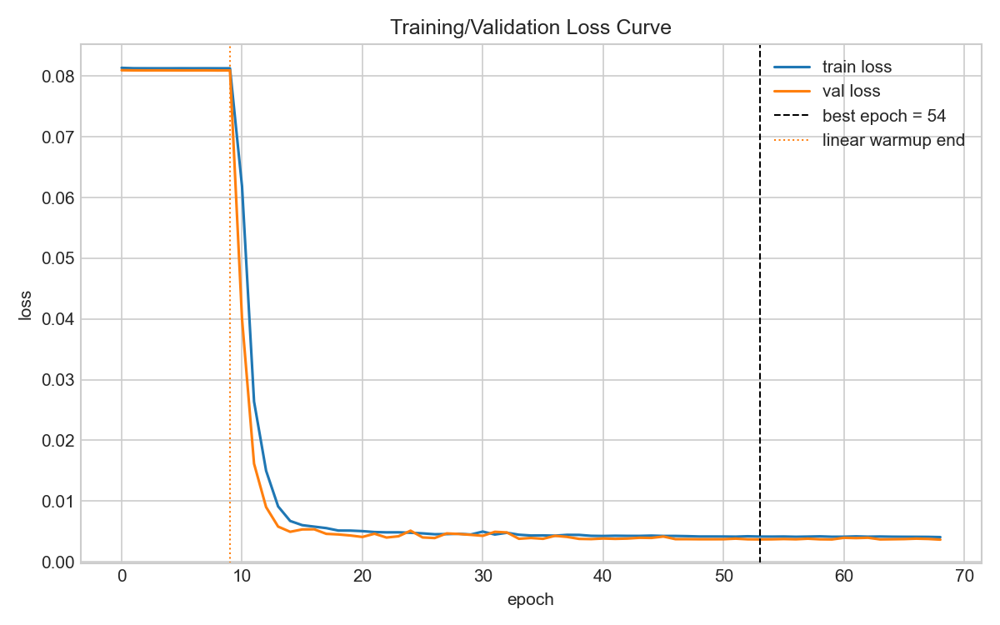
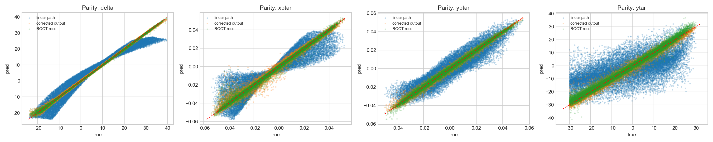
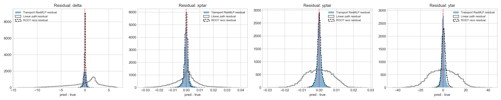
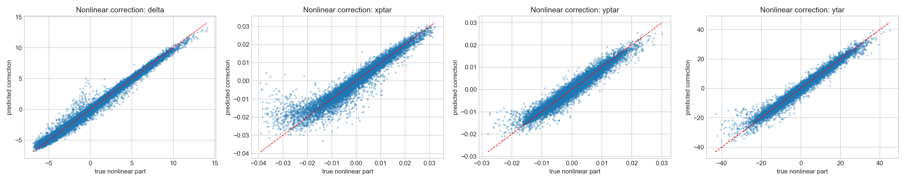

# ResMLP_transport 实验记录

- 日期：`2026-04-09`
- Notebook：`SHMS_Calibration_NN/experiments/ResMLP/ResMLP_transport.ipynb`
- 最新运行标签：`20260409_041954`

## 1. 实验目标

`ResMLP_transport` 的目标是构建一个**不依赖 ROOT 重建结果作为训练 baseline** 的 SHMS optics 重建模型。

与之前的 ROOT-residual 方案不同，这个版本不再训练

- $y_{\text{truth}} - y_{\text{ROOT}}$

而是直接在网络内部做结构分解：

- 线性 transport 主干负责学习 spectrometer 的零阶 / 一阶近似；
- 残差分支负责学习高阶非线性修正；
- 最终输出满足

$$
y = y_{\text{linear}} + y_{\text{correction}}
$$

这样做的核心思想是 **perturbation learning**：让模型先搭建可解释的线性骨架，再由残差分支补偿 fringe field、aberration 和更复杂的非线性项。

## 2. 模型结构

当前 `ResMLP_transport` 由三部分组成：

1. **Linear path**
   - 一个从输入到输出的线性层；
   - 代表零阶 / 一阶 transport map；
   - 使用训练集最小二乘解进行初始化，而不是随机初始化。

2. **Residual nonlinear branch**
   - 先经过一个输入投影层；
   - 然后进入多个 residual block；
   - 每个 block 内部采用 skip connection，改善梯度传播与收敛稳定性。

3. **Correction head**
   - 输出非线性修正项；
   - 与线性主干输出相加得到最终结果。

简化后的结构可以写成：

$$
\hat y = W_{\text{linear}} x + f_{\text{residual}}(x)
$$

其中：

- $W_{\text{linear}} x$ 是线性 transport；
- $f_{\text{residual}}(x)$ 是高阶非线性修正。

## 3. 训练策略

本次运行使用了以下关键设置：

- 数据文件：`mc-single-arm/worksim/shms_extended_nosieve.root`
- 树名：`h10`
- 模式：`all`
- 输入特征：`x_fp, y_fp, xp_fp, yp_fp, x_tar, p0`
- 输出目标：`delta, xptar, yptar, ytar`
- 事件数：100000
- 训练 / 验证划分：80000 / 20000
- Batch size：2048
- 学习率：`8e-4`
- Weight decay：`1e-4`
- Hidden dim：192
- Residual blocks：4
- Dropout：0.10
- 线性层初始化：最小二乘 + ridge=`1e-6`
- 训练前 10 个 epoch：只训练线性主干
- 之后冻结线性主干，只训练非线性修正分支
- 损失函数：加权 `SmoothL1`
- `ytar` loss weight：0.5
- 非线性修正 L2 正则：`1e-4`
- 早停：patience = 15

## 4. 最新训练结果（2026-04-09 04:19:54）

### 4.1 总体结果

- `best_epoch = 54`
- `best_val_loss = 0.003684`
- `n_train = 80000`
- `n_val = 20000`

### 4.2 各目标 RMSE 对比

| Target | Linear path RMSE | Transport ResMLP RMSE | ROOT reco RMSE | ResMLP 相对线性提升 |
|---|---:|---:|---:|---:|
| delta | 3.352445 | 0.458363 | 0.316723 | 86.33% |
| xptar | 0.009182 | 0.002699 | 0.002300 | 70.61% |
| yptar | 0.007472 | 0.001563 | 0.001544 | 79.08% |
| ytar | 11.370134 | 1.809712 | 2.006163 | 84.08% |

### 4.3 各目标 MAE

| Target | ResMLP MAE | ROOT reco MAE |
|---|---:|---:|
| delta | 0.329776 | 0.147366 |
| xptar | 0.001542 | 0.001191 |
| yptar | 0.001043 | 0.001048 |
| ytar | 1.237103 | 1.443438 |

### 4.4 关键观察

1. **模型已经完全脱离 ROOT residual baseline 训练**，这是本实验最重要的结构性成果。
2. **`ytar` 已经优于 ROOT reco**：
   - ResMLP RMSE = `1.809712`
   - ROOT reco RMSE = `2.006163`
3. 对 `delta / xptar / yptar`，当前版本仍略弱于 ROOT reco，但已经明显优于内部线性主干。
4. 线性主干本身仍然比较粗糙，说明对于当前输入特征而言，`delta` 和 `ytar` 的有效映射中仍存在较强非线性。

## 5. 非线性修正质量

非线性真值项与预测 correction 的相关性（来自诊断输出）为：

| Target | corr(true nonlinear, predicted correction) |
|---|---:|
| delta | 0.9904 |
| xptar | 0.9554 |
| yptar | 0.9777 |
| ytar | 0.9871 |

这说明残差分支确实在学习高阶修正，而不是简单重复线性主干的功能。

## 6. 可视化结果

### 6.1 相对 RMSE 对比

### 6.2 训练 / 验证 Loss 曲线

### 6.3 Parity 图

### 6.4 Residual 分布

### 6.5 非线性修正 Parity 图

## 7. 结果解读

从当前结果看，这个结构已经达到了两个关键目的：

- **结构上独立于 ROOT 重建**；
- **数值上成功学到了有效的非线性 correction**。

尤其是 `ytar` 的改进比较有代表性：它说明即使不把 ROOT 结果作为训练 baseline，网络仍然能依靠内部线性路径 + 残差修正的方式恢复有物理意义的重建关系。

不过，要让该模型在所有目标上全面超过 ROOT reco，后续仍建议继续强化：

- 线性主干的物理约束；
- `delta` 的专门优化；
- 更强的多头输出或 target-specific correction branch；
- 更贴近 optics transport 的显式矩阵参数化。

## 8. 关联产物

- 指标 JSON：`../outputs_transport_skip/transport_resmlp_metrics_all_20260409_041954.json`
- 指标 CSV：`../outputs_transport_skip/transport_resmlp_metrics_all_20260409_041954.csv`
- Notebook：`../ResMLP_transport.ipynb`

## 9. 一句话总结

`ResMLP_transport` 已经成功实现了“**线性 transport + 非线性残差修正**”的 ROOT 无关训练框架，并在 `ytar` 上取得了优于 ROOT reco 的结果，是一个可继续物理化和精细化优化的有效基线。
