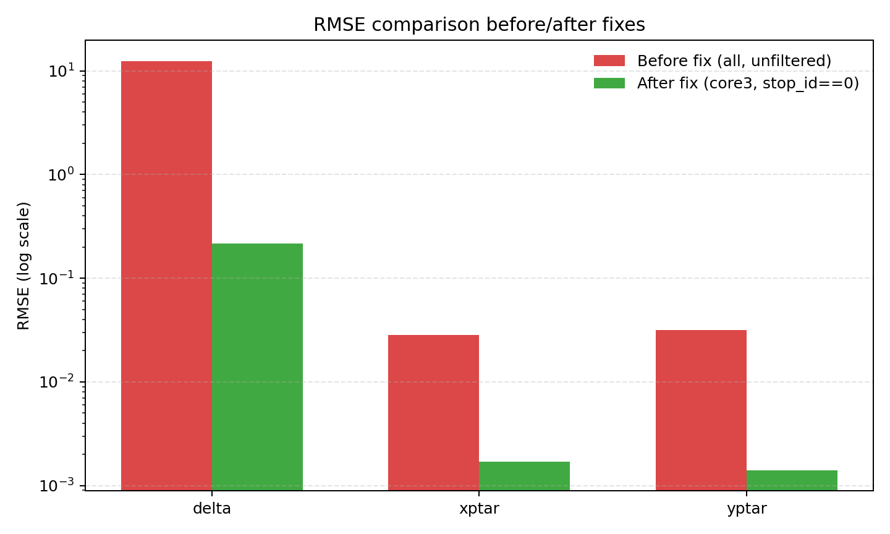
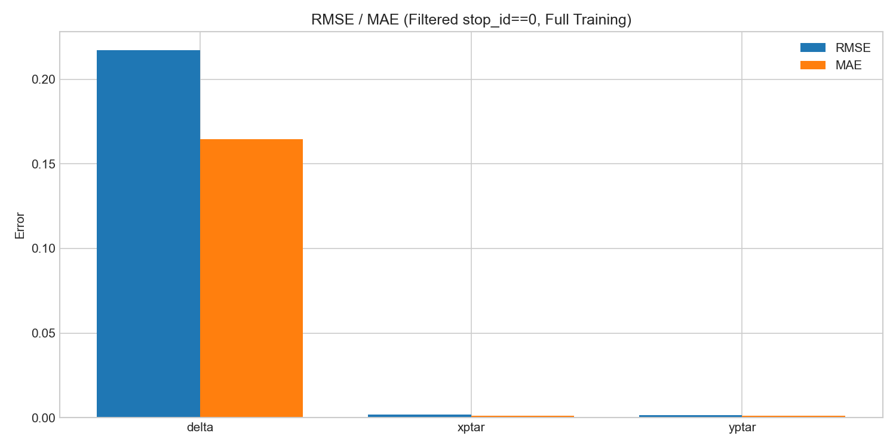
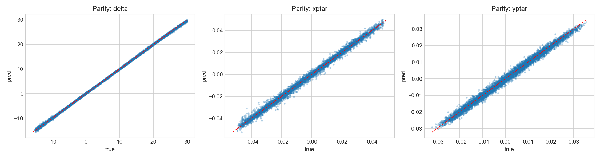
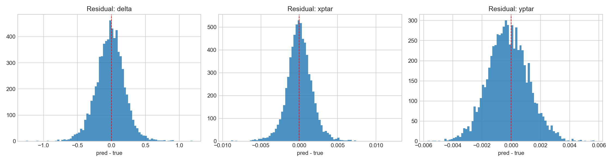
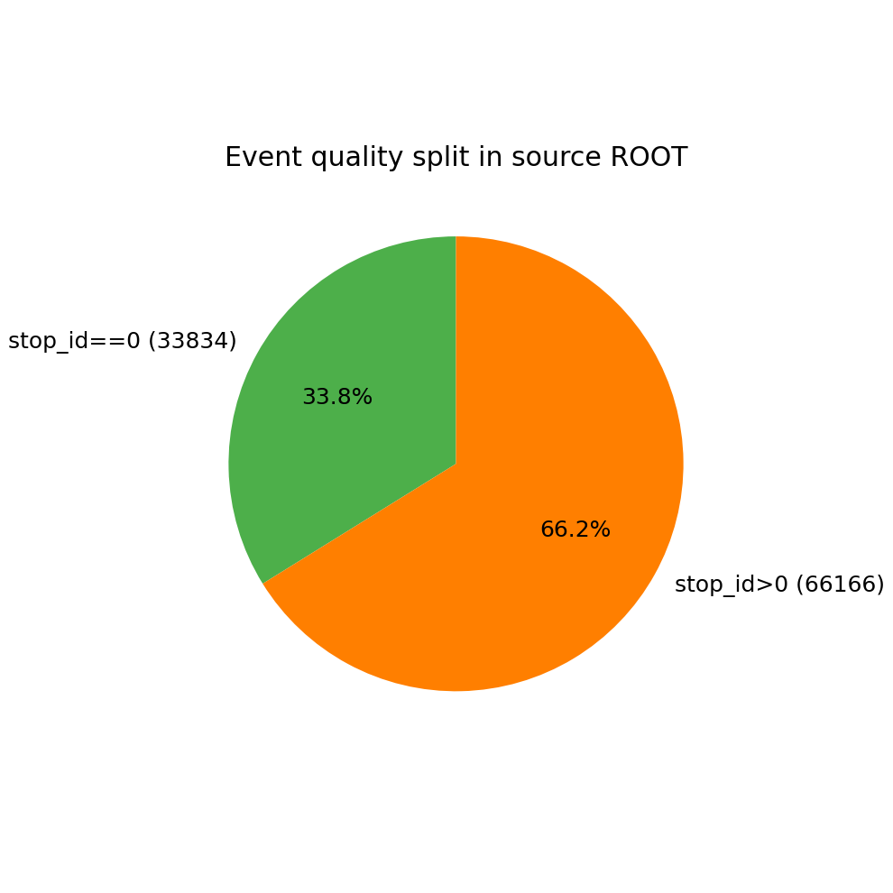

# SHMS NN Training Results Brief (2026-04-02)

## 1) Current Neural Network Architecture
- **Model**: Residual MLP (shared backbone + regression heads)
- **Inputs (6D)**: `x_fp, y_fp, xp_fp, yp_fp, x_tar, p0`
- **Main outputs (core3)**: `delta, xptar, yptar`
- **Optimizer**: AdamW
- **Training strategy**: full-data training + validation monitoring
- **Key data strategy**: keep only successful events with `stop_id==0`; keep `p0` consistent with `.inp` (1.4 GeV)

> Note: In your analysis convention, `ytar` corresponds to `ztari` (derived from y-related quantities). In this run, we fixed the mainline to `core3` and analyzed `ztari` separately.

## 2) Training Results (Key Focus)

### 2.1 Metrics before vs after fixes (shared targets)
- Before fixes (all targets, no filtering)
  - `delta` RMSE: **12.4703**
  - `xptar` RMSE: **0.02815**
  - `yptar` RMSE: **0.03166**
- After fixes (core3, filtered with `stop_id==0`)
  - `delta` RMSE: **0.21719**
  - `xptar` RMSE: **0.001693**
  - `yptar` RMSE: **0.001398**

Conclusion: after applying `core3 + successful-event filtering`, errors on all three primary targets dropped significantly, and training entered a practically usable regime.

### 2.2 Final mainline training plots (core3)
- RMSE/MAE:

- Prediction vs truth (parity):

- Residual distribution:

## 3) Data Quality vs Training Performance
- Total events: `100000`
- Successful events (`stop_id==0`): `33834` (33.8%)
- Failed events (`stop_id>0`): `66166` (66.2%)

The high failed-event ratio was a major source of early training degradation; the post-filter performance gain is fully consistent with this diagnosis.

## 4) Immediate Value for Next Work
- Established a reproducible mainline: `ROOT -> quality filtering -> Residual MLP(core3) -> visual evaluation`
- Confirmed high-priority settings: `stop_id==0`, aligned `p0`, train `core3` before `ztari`
- Provided a comparable baseline for next-stage generalization (across momentum and angle settings)

## 5) Next Steps (Brief)
1. Expand the training set with ROOT files from more kinematic settings, while keeping the same filtering standard.  
2. Lock the `core3` baseline and add cross-setting validation.  
3. Diagnose `ztari(=ytar)` as a single-task branch with expanded inputs, then reconsider multi-task integration.  

---
Recorded by: Copilot (GPT-5.3-Codex)
