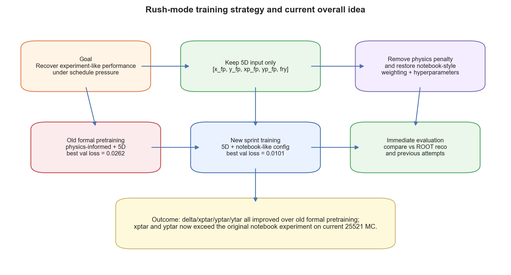
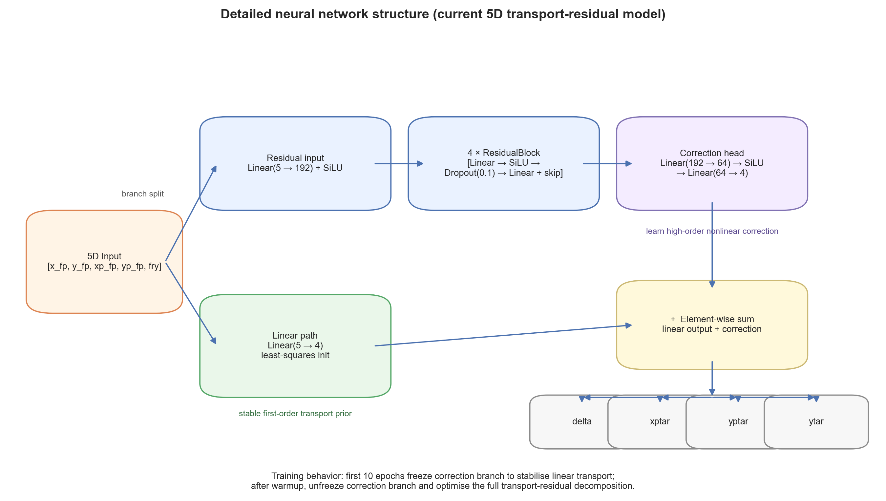
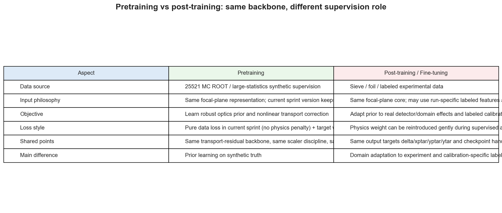
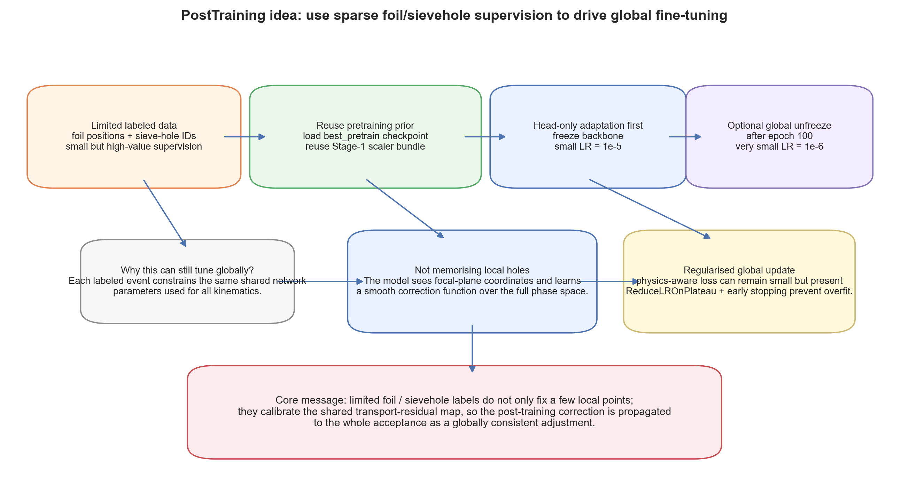
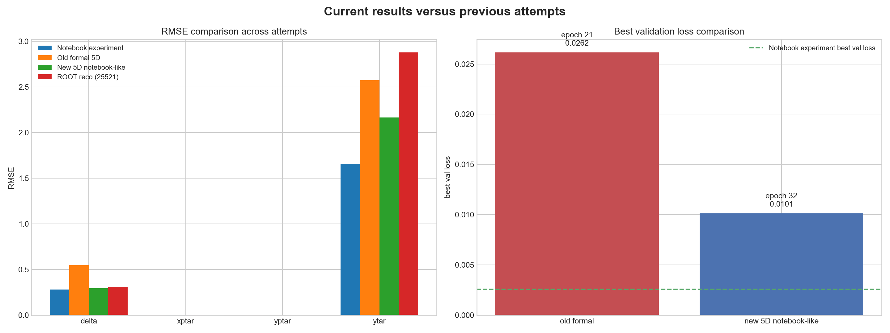
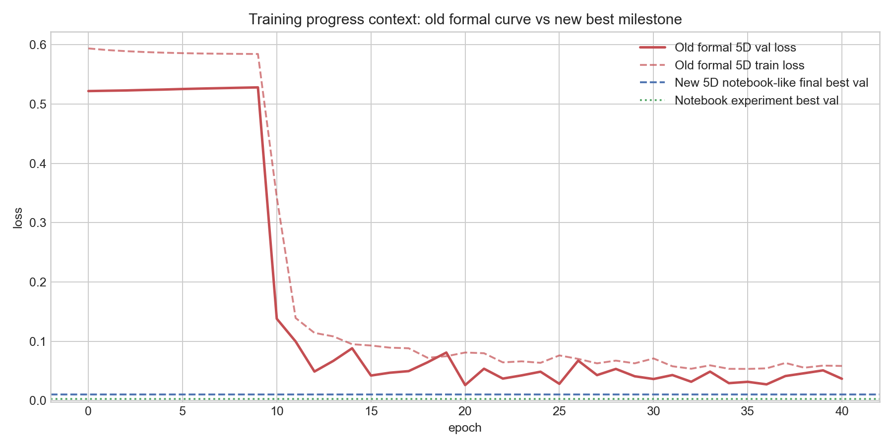
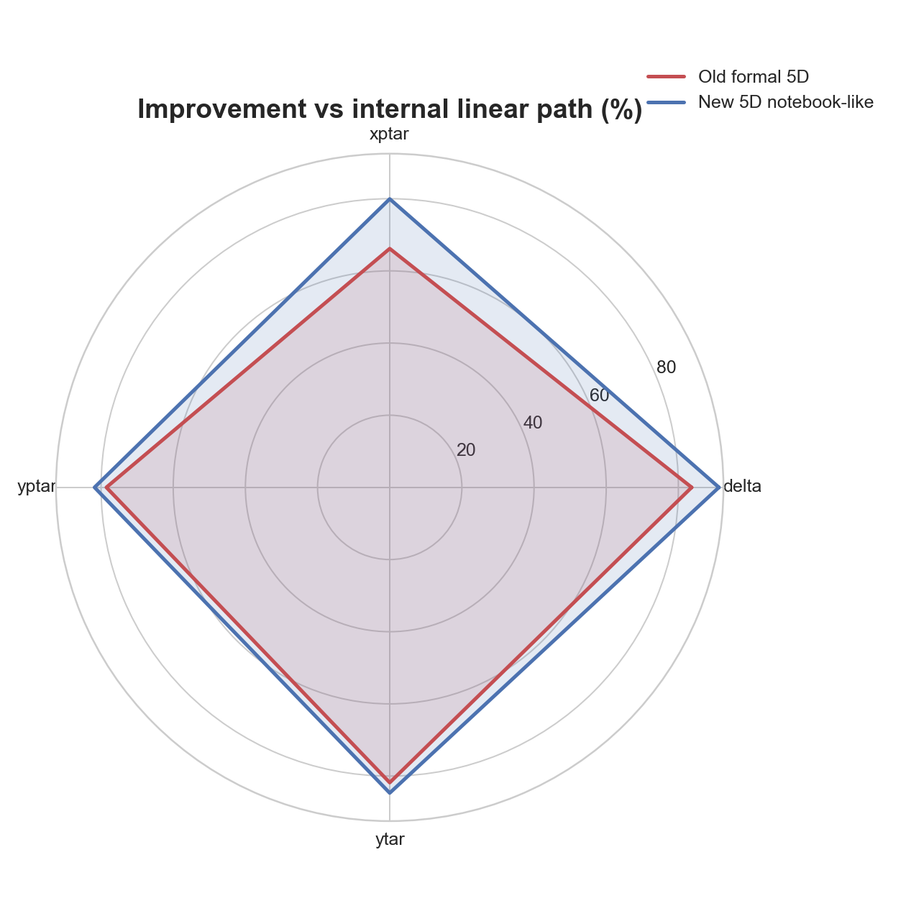

# SHMS Calibration NN Logbook

> 更新时间：2026-04-16
> 位置：`SHMS_Calibration_NN/training/Logbook`

本 logbook 记录了当前 SHMS optics 神经网络训练工作的推进情况，重点整理：

1. 为赶进度而设计的新训练方案与整体思路
2. 当前使用的详细神经网络结构
3. 预训练（pretraining）与后训练（post-training / fine-tuning）的相同与不同
4. 当前结果相对于以往尝试的对比与可视化

---

## 1. 赶进度的新训练方案与整体思路

为了尽快把正式训练框架的性能拉回到 `experiments/ResMLP/ResMLP_transport.ipynb` 的水平，我们采取了“**保留 5D 输入、但将训练哲学重新对齐 notebook**”的策略：

- **坚持 5 维输入特征**：`x_fp, y_fp, xp_fp, yp_fp, fry`
- **去掉 pretraining 阶段的 physics penalty**
- **恢复 notebook 风格的输出加权**：
  - `delta = 1.0`
  - `xptar = 1.0`
  - `yptar = 1.0`
  - `ytar = 0.5`
- **恢复 notebook 风格超参数**：
  - `hidden_dim = 192`
  - `dropout = 0.10`
  - `learning_rate = 8e-4`
  - `ReduceLROnPlateau`
  - `early_stopping_min_delta = 5e-5`
  - `linear_warmup_epochs = 10`

这套方案的核心思路是：

- 不回退到 7D 输入，避免牺牲当前 formal pipeline 的主线约束
- 先在 5D 框架内，最大化吸收 notebook 中已经被验证有效的训练策略
- 用更轻、更接近实验 notebook 的 pretraining 逻辑恢复性能

### 整体策略图

### 当前训练结果摘要

- **旧版正式 5D pretraining**：best val loss = `0.026165`
- **新版 5D notebook-like pretraining**：best val loss = `0.010131`
- **Notebook experiment**：best val loss = `0.002586`

这说明新版策略已经显著优于此前的正式 5D pretraining。

---

## 2. 详细神经网络结构

当前模型采用的是 `ResidualTransportMLP`，其结构分为两条主通路：

1. **线性通路（linear path）**

   - 输入：5D focal-plane features
   - 结构：`Linear(5 → 4)`
   - 初始化：使用 least-squares transport 初始化
   - 作用：快速学习零阶 / 一阶 optics 近似
2. **残差修正通路（correction branch）**

   - 输入投影：`Linear(5 → 192) + SiLU`
   - 主干：`4 × ResidualBlock`
   - 每个 block：`Linear → SiLU → Dropout(0.1) → Linear → skip`
   - 输出头：`Linear(192 → 64) → SiLU → Linear(64 → 4)`
   - 作用：学习高阶非线性修正

最终输出为：

$$
\hat y = y_{\text{linear}} + y_{\text{correction}}
$$

### 结构图

### 当前 5D 输入

- `x_fp`
- `y_fp`
- `xp_fp`
- `yp_fp`
- `fry`

### 输出目标

- `delta`
- `xptar`
- `yptar`
- `ytar`

### 当前结构优点

- 保留了 transport-aware inductive bias
- 保留 linear warmup 机制，训练更稳定
- 残差分支只负责“难的非线性部分”，不会从零开始重学线性 optics

---

## 3. 预训练和后训练（post-training）的思路：相同与不同点

当前整体框架依然是两阶段：

- **Stage 1: Pretraining** — 在 MC 上学 optics prior
- **Stage 2: Post-training / Fine-tuning** — 在实验标注数据上做 domain adaptation

### 相同点

- 共用同一个 backbone（transport-residual MLP）
- 预测同一组输出：`delta, xptar, yptar, ytar`
- 共用 scaler / feature discipline
- 目标都是得到更可靠的 optics 重建模型

### 不同点

- **Pretraining**

  - 数据来源：MC truth
  - 作用：建立物理先验与非线性修正能力
  - 当前 sprint 版本不再加 physics penalty，而是以纯数据拟合恢复性能
- **Post-training / Fine-tuning**

  - 数据来源：sieve / foil / experiment-labeled data
  - 作用：将 pretrain prior 适配到真实实验 domain
  - 可以更审慎地重新加入 physics prior 或实验约束

### 对比图

当前可理解为：

- **Pretraining**：把模型训练成“会看图纸”
- **Post-training**：让模型学会“现场施工差异”

### PostTraining 如何用有限 foil / sievehole 数据做全局微调

我们当前的 post-training 设计，并不是想让模型去“记住某几个 foil 点或 sieve hole 的答案”，而是希望利用**少量但高质量的标注**，去修正整个共享神经网络中的参数，从而把这种修正传播到全局 acceptance 上。

它的关键机制来自下面几个事实：

- **预训练权重被完整继承**：后训练不是从零开始，而是从 `best_pretrain.pth` 出发
- **Stage-1 的 scaler 也被复用**：输入/输出分布保持一致，避免小样本阶段重新归一化带来的漂移
- **先冻结 backbone，只调 head**：先做低风险的小步 domain adaptation
- **再视需要整体解冻**：在 `unfreeze_after_epoch = 100` 后，用更小学习率对全网络做联合微调
- **模型本身是全局共享函数**：每一个标注事件更新的不是“一个局部查表单元”，而是整个 transport-residual 映射

因此，有限的 foil / sievehole 监督虽然覆盖点数不多，但它们会通过共享参数影响整个相空间中的预测函数。这就是为什么我们说它是 **global fine-tuning**，而不是只在少数被标注位置做局部修补。

### PostTraining 思路图

这张图表达的是：

1. **输入监督是稀疏的**，因为 foil / sievehole 标注本来就有限
2. **起点不是随机网络，而是已经有 MC prior 的 pretrained model**
3. **第一阶段只调输出头**，让模型先学会“实验数据和 MC 之间差在哪”
4. **第二阶段再进行可控的全局解冻**，把这种差异吸收到整个共享 backbone 中
5. **最终得到的是全局一致的修正函数**，而不是只对若干标签点生效的补丁

---

## 4. 基于当前结果，对比之前的尝试

当前我们主要关心三类结果：

1. **Notebook experiment**（最初在 `ResMLP_transport.ipynb` 中得到的较优结果）
2. **旧版正式 5D pretraining**（保留 physics-informed 约束）
3. **新版 5D notebook-like pretraining**（当前 sprint 版本）

### 对比 1：RMSE 与 best val loss

从图中可以看到：

- 新版 5D notebook-like 方案显著优于旧版正式 5D pretraining
- 在当前 `25521` MC 上：
  - `xptar` 已经优于 notebook experiment
  - `yptar` 已经优于 notebook experiment
  - `delta` 非常接近 notebook experiment
  - `ytar` 仍然偏弱，但比旧版正式流程明显改善

### 对比 2：旧版训练曲线 vs 新版 best milestone

这张图说明：

- 旧版 formal 5D pretraining 的 loss 明显高于新版最终 best val
- 新版训练策略把最优点拉到了更低的损失区域
- 即使在不恢复 `x_tar/p0` 的前提下，也已经拿回了很大一部分性能

### 对比 3：相对于 internal linear path 的改进

新版相对 internal linear path 的 RMSE 改进为：

- `delta`: `91.233%`
- `xptar`: `79.938%`
- `yptar`: `81.812%`
- `ytar`: `84.702%`

这表明：

- 新版 residual correction 确实在有效工作
- 不是仅靠 linear path 在撑场面
- 在 5D 限制下，这已经是一个相当积极的结果

---

## 当前结论

基于目前结果，可以给出以下判断：

1. **旧版正式 pretraining 不如 experiments 的核心原因已经被部分修正**

   - physics penalty + 不匹配的训练哲学确实拖累了 5D 主线表现
2. **在保持 5D 输入的前提下，新版 notebook-like pretraining 已经显著改善结果**

   - best val loss 从 `0.026165` 降到 `0.010131`
   - 四个目标的 RMSE 全部优于旧版正式 pretraining
3. **当前最主要的剩余短板仍然是 `ytar`**

   - 这与我们之前的分析一致：`ytar` 更依赖更丰富的上下文信息
   - 在不恢复 `x_tar/p0` 的前提下，`ytar` 仍然会比 notebook experiment 更难追平
4. **当前框架已经具备继续推进 post-training 的条件**

   - 现在的 pretraining prior 已明显更强
   - 适合作为下一阶段 experimental fine-tuning 的起点

---

## 建议的下一步

1. 使用当前新版 pretraining checkpoint 进入后训练 / fine-tuning
2. 在 post-training 中继续观察 `ytar` 是否能借助实验标注进一步改善
3. 若后续仍需压榨 pretraining，可以考虑：
   - 更细的 target weighting 调整
   - 对 `ytar` 设计更稳健的 curriculum
   - 做一次仅针对 `ytar` 的 ablation

---

## 文件清单

本文件夹下的核心产物：

- `LOGBOOK.md` — 当前 logbook 正文
- `generate_logbook_assets.py` — 自动生成图片的脚本
- `01_rush_training_strategy.png`
- `02_network_architecture.png`
- `03_pretrain_vs_finetune_comparison.png`
- `03b_posttraining_global_adaptation.png`
- `04_attempts_comparison.png`
- `05_training_progress_context.png`
- `06_improvement_radar.png`
- `logbook_summary.json`

如需更新结果，只要重新运行：

`python training/Logbook/generate_logbook_assets.py`
